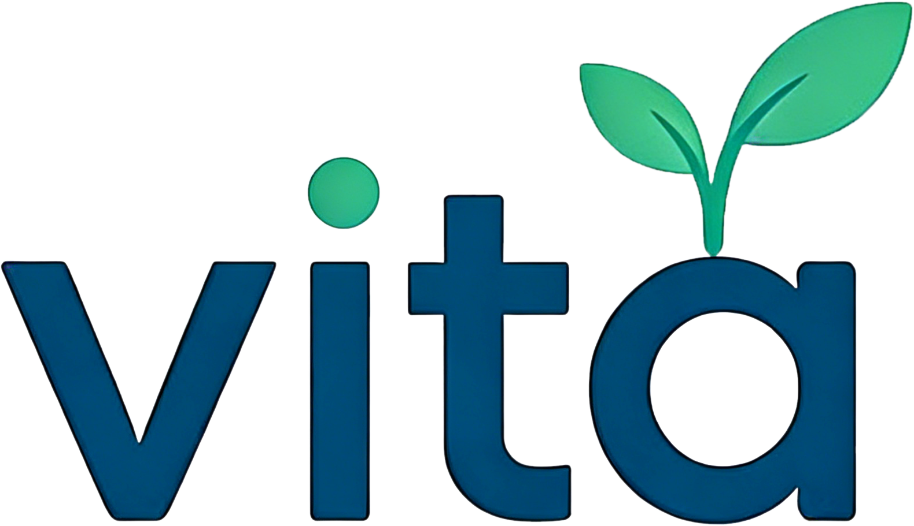
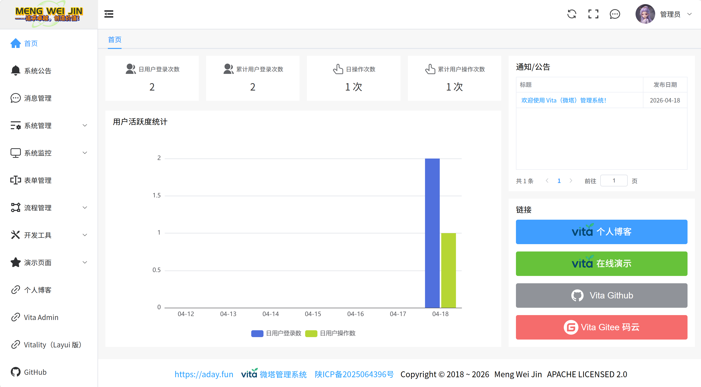
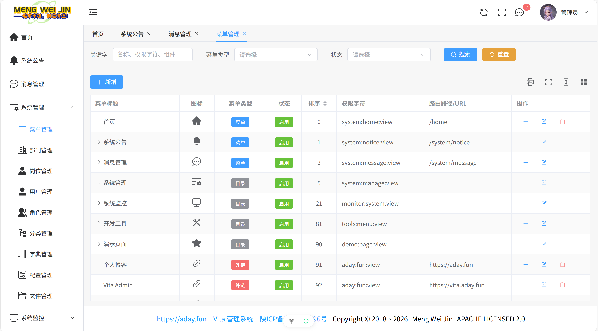
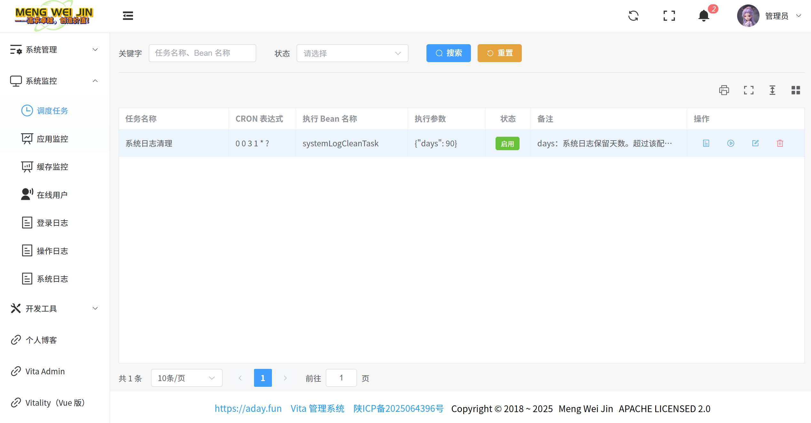
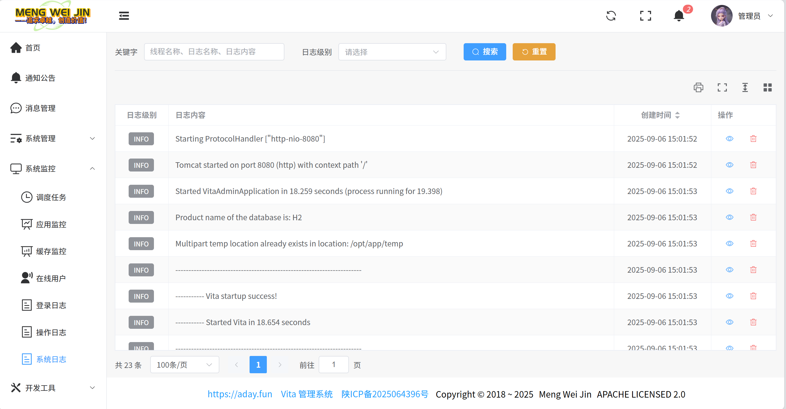
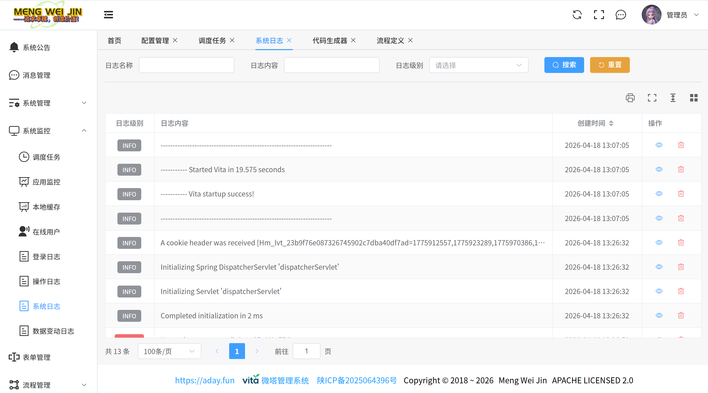
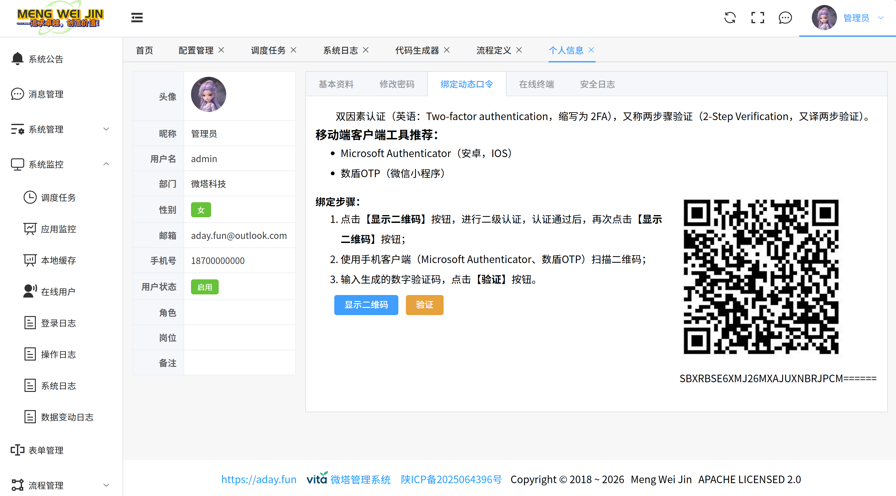

<p align="center">
	
</p>
<h1 align="center" style="margin: -15px 0 35px 0;">Vita（微塔）管理系统</h1>
<p align="center">
    <a target="_blank" href="https://github.com/mengweijin/vita">
		
	</a>
    <a target="_blank" href="https://gitee.com/mengweijin/vita">
		
	</a>
	<a target="_blank" href="https://central.sonatype.com/artifact/com.github.mengweijin/vita-parent/versions">
		
	</a>
	<a target="_blank" href="https://github.com/mengweijin/vita/blob/master/LICENSE">
		
	</a>
	<a target="_blank" href="https://www.oracle.com/technetwork/java/javase/downloads/index.html">
		
	</a>
	<a target="_blank" href="https://gitee.com/mengweijin/vita/stargazers">
		
	</a>
    <a href='https://gitee.com/mengweijin/vita/members'>
      
    </a>
	<a target="_blank" href='https://github.com/mengweijin/vita'>
		
	</a>
	<a target="_blank" href='https://github.com/mengweijin/vita'>
		
	</a>
    <br>
    <a target="_blank" href="https://sonarcloud.io/summary/overall?id=mengweijin_vita&branch=master">
		
	</a>
    <br>
    <a target="_blank" href="https://sonarcloud.io/summary/overall?id=mengweijin_vita&branch=master">
		
	</a>
    <a target="_blank" href="https://sonarcloud.io/summary/overall?id=mengweijin_vita&branch=master">
		
	</a>
    <a target="_blank" href="https://sonarcloud.io/summary/overall?id=mengweijin_vita&branch=master">
		
	</a>
    <a target="_blank" href="https://sonarcloud.io/summary/overall?id=mengweijin_vita&branch=master">
		
	</a>
    <a target="_blank" href="https://sonarcloud.io/summary/overall?id=mengweijin_vita&branch=master">
		
	</a>
    <a target="_blank" href="https://sonarcloud.io/summary/overall?id=mengweijin_vita&branch=master">
		
	</a>
    <a target="_blank" href="https://sonarcloud.io/summary/overall?id=mengweijin_vita&branch=master">
		
	</a>
    <a target="_blank" href="https://sonarcloud.io/summary/overall?id=mengweijin_vita&branch=master">
		
	</a>
    <a target="_blank" href="https://sonarcloud.io/summary/overall?id=mengweijin_vita&branch=master">
		
	</a>
</p>

<p align="center">
   <span><strong>Vita（微塔）</strong>：是一款<strong>轻量级快速开发平台应用系统</strong>。</span><br>
   <span>基于 SpringBoot、sa-token、mybatis-plus、vue、element-plus 等技术，不依赖任何第三方服务。</span>
</p>
<p style="text-indent:2em;">
   有时候我们就想做一个简单的东西，采用已有的开源框架却要依赖一大堆东西（如：redis, minio/fastdfs，数据库等），以及很复杂的配置文件，自己从零搭建又太耗费时间，<strong>真的太麻烦了！</strong>
</p>
<p style="text-indent:2em;">
   于是，就有了 <strong>Vita（微塔）</strong>，它可以帮你节省很多时间和精力，非常适合一个人即一个团队的小体量工作环境。
</p>

## 在线演示

<https://vita.aday.fun>

## 启动应用

### 源码启动

默认前后端一体化部署，因此你只需要一个 JDK 17 的运行环境，然后直接启动即可！

```shell
# 默认使用 h2 数据库，当然，你也可以切换为其它数据库
java -jar vita-admin.jar

# 或指定参数
java -Dname=vita-admin -Dspring.profiles.active=h2 -Dfile.encoding=utf-8 -Duser.timezone=Asia/Shanghai -Xms128m -Xmx512m -jar vita-admin.jar
```

浏览器访问：http://localhost:8080

注：当然，你也可以使用 nginx 代理服务器前后端分离部署。更多文档参考：

- [打包指南](docs/package.md)
- [部署指南](docs/deploy.md)

### 后端 SDK 化启动

使用方式可参考 SDK 化的示例工程：[vita-sdk-demo](./vita-sdk-demo)

很多时候，我们依赖上游应用，就希望可以在 maven 中直接依赖一个 jar 包，而不是克隆所有源代码，以方便基础工程的更新迭代。

此时就需要将基础工程 SDK 化，打包成 jar 发布到 maven 中央仓库。幸运的是，本项目已经将 jar 发布到了 maven 中央仓库。

核心操作如下：

1. 将 pom.xml 中的 parent 配置为如下示例：

    ```xml
        <parent>
            <groupId>com.github.mengweijin</groupId>
            <artifactId>vita-parent</artifactId>
            <version>${vita.version}</version>
        </parent>
    ```

2. 将 pom.xml 中的依赖增加如下示例：

    ```xml
    <dependency>
        <groupId>com.github.mengweijin</groupId>
        <artifactId>vita-framework</artifactId>
    </dependency>
    ```

3. 然后增加一个 @SpringBootApplication 启动类，添加 vita 扫描包路径（如下）和自己工程的扫描包路径（请自行添加）。

   ```text
   @ComponentScan(basePackages = { "com.github.mengweijin.vita" })
   @MapperScan(basePackages = { "com.github.mengweijin.vita.**.mapper" })
   ```

### 功能矩阵

| ------ |  ------   |  ------  |  ------   | ------  |
|:------:|:---------:|:--------:|:---------:|:-------:|
|   首页   |   调度任务    |   角色授权   |    工作流    |  图片裁剪   |
|  系统公告  |   应用监控    |   数据脱敏   |   流程分类    | 富文本编辑器  |
|  消息管理  |   本地缓存    |   字典翻译   |   流程表单    |  图标选择器  |
|  菜单管理  |   在线用户    |   接口限流   |   流程定义    | 表格工具条组件 |
|  部门管理  |   登录日志    |   缓存过期   |   流程设计器   | 二级认证组件  |
|  岗位管理  |   操作日志    |   接口防抖   | 流程实例（开发中） | 用户选择组件  |
|  用户管理  |   系统日志    |   全局异常   | 待办任务（开发中） | 角色选择组件  |
|  角色管理  |  数据变动日志   |   数据权限   | 我的任务（开发中） | 岗位选择组件  |
|  分类管理  |   接口文档    |  配置热刷新   | 我发起的（开发中） | 部门选择组件  |
|  字典管理  |   代码生成器   | 自定义数据验证  | 我的待办（开发中） | 字典标签组件  |
|  配置管理  |    国际化    | SSE 消息推送 | 我的已办（开发中） | 字典选择组件  |      
|  文件管理  | 数据存储自动加解密 |   二级认证   | 抄送我的（开发中） | 权限控制指令  |

### 演示图

|  |  |    
|-----------------------------------:|:-----------------------------------|
|  |  | 
|  |  | 

## ⭐Star Vita on GitHub

[](https://www.star-history.com/?repos=mengweijin%2Fvita&type=date&legend=top-left)